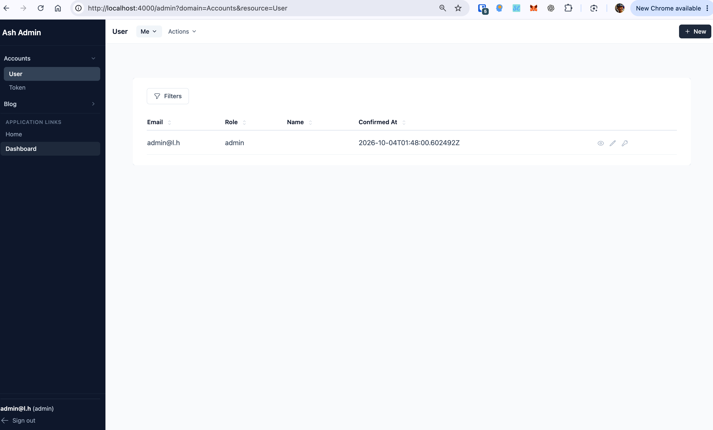

# Ash Demo

Play ash!

## Prompts

项目使用的ash框架 ash_authentication，ash_authentication_phoenix，ash_admin，
actor resource是Demo.Accounts.User，使用ash_authentication做ash_admin验证入口，默认admin布局是左侧显示actor相关信息
如何定制admin的页面布局，使左侧导航actor处显示当前登录的admin信息

相关技术文档：[AshAdmin 管理员认证与授权](docs/admin-authentication.md)

## Get started

To start your Phoenix server:

* Run `mix setup` to install and setup dependencies
* Start Phoenix endpoint with `mix phx.server` or inside IEx with `iex -S mix phx.server`

Now you can visit [`localhost:4000`](http://localhost:4000) from your browser.

Ready to run in production? Please [check our deployment guides](https://phoenix.hexdocs.pm/deployment.html).

## Learn more

* Official website: https://www.phoenixframework.org/
* Guides: https://phoenix.hexdocs.pm/overview.html
* Docs: https://phoenix.hexdocs.pm
* Forum: https://elixirforum.com/c/phoenix-forum
* Source: https://github.com/phoenixframework/phoenix
